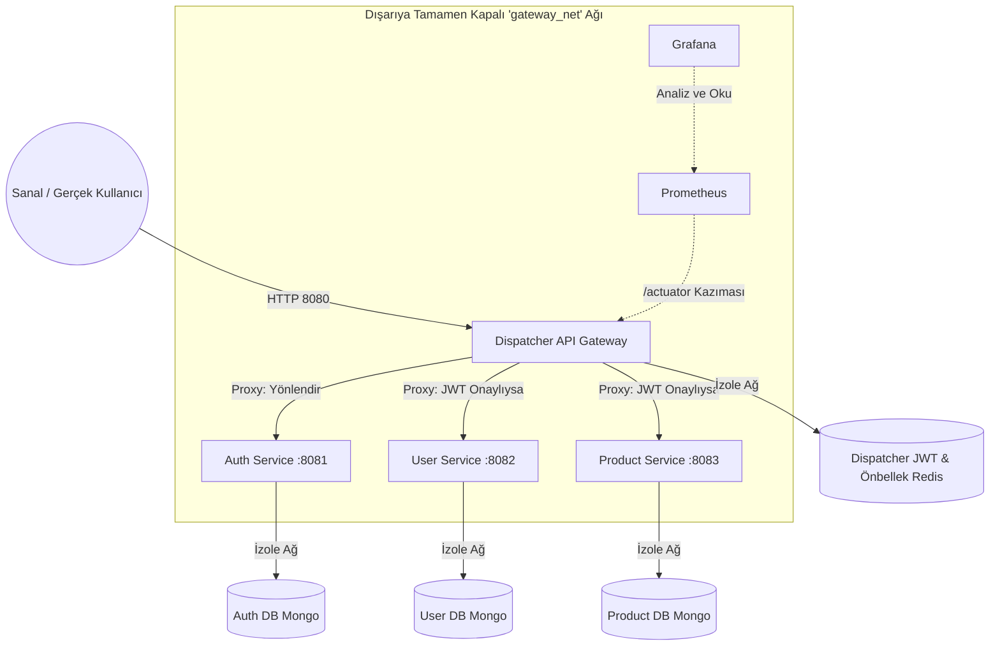
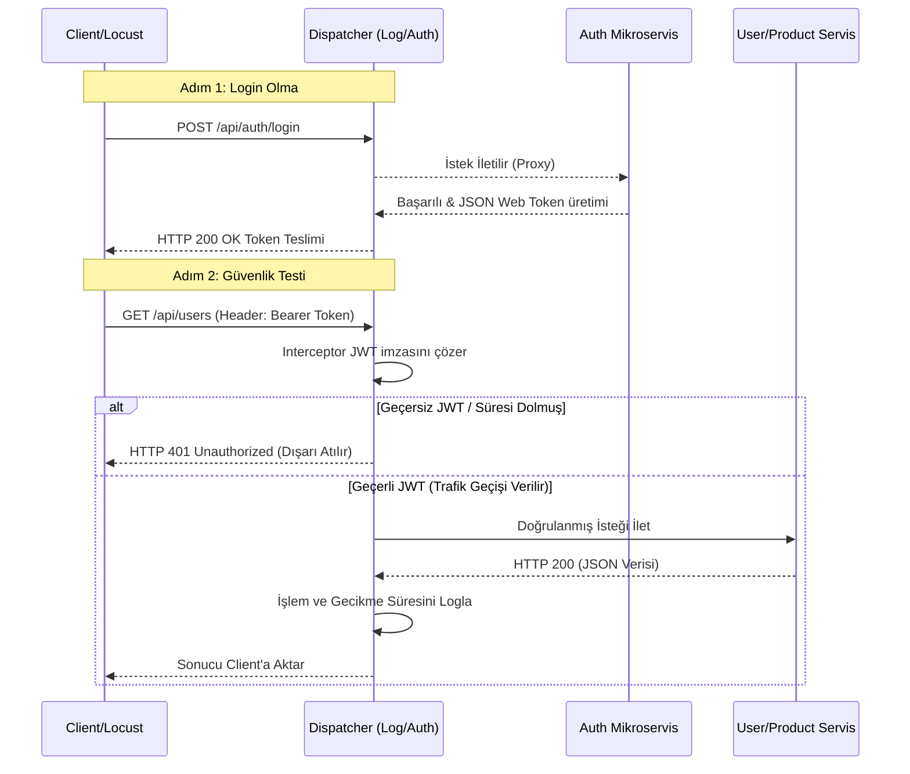
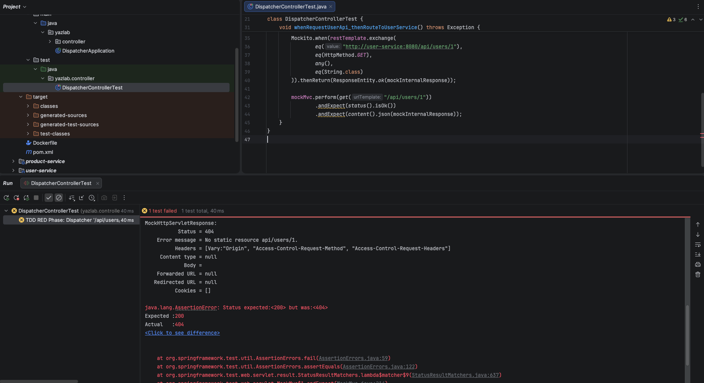
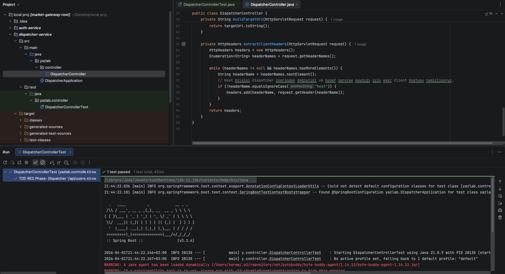
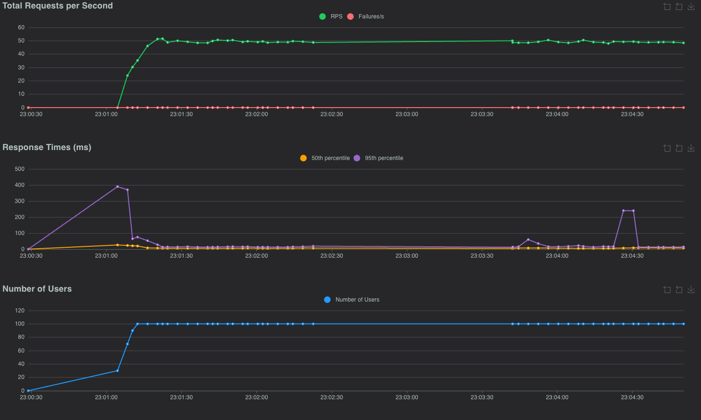
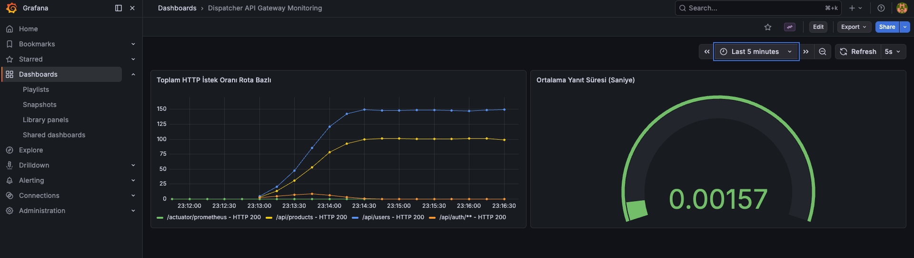

# Modern Yazılım Geliştirme: Mikroservis API Gateway (Dispatcher) Projesi

**Proje Ekibi:** Kerem Emre Gümüştaş - Eren Ceylan  
**Tarih:** 5 Nisan 2026

## 1. Proje Amacı ve Kapsamı
Bu projenin amacı, dış dünyaya tamamen kapalı uçtan-uca izole bir Mikroservis mimarisi geliştirmek; bu servisler arasındaki trafik yönetimini modüler, loglanabilir ve güvenli bir **Dispatcher (API Gateway)** üzerinden geçirmektir.

Sistemde Dispatcher birimi **TDD (Test-Driven Development)** yaklaşımları gözetilerek inşa edilmiş olup; Auth, User ve Product olmak üzere tam 3 adet bağımsız mikroservisin haberleşmesi JSON ve RESTful konseptleri (Richardson Maturity Model - RMM) kullanılarak kodlanmıştır.

## 2. Richardson Olgunluk Modeli (RMM) ve RESTful Kavramları
Projeye özel geliştirilen mikroservislerdeki API tasarımlarında **RMM Seviye 2 standartları** titizlikle uygulanmıştır. 
Klasik URL yapılarında yapılan eylemleri belirten `.../deleteUser` veya `.../addProduct` formundaki isimlerden (Verb) kesinlikle kaçınılmıştır. Zira Restful'un kalbi Kaynaklara (Resources) odaklanmaktır.
Sistemde sadece `/api/users` ve `/api/products` şeklinde URL kaynakları bulunmaktadır. İlgili CRUD eylemleri doğru **HTTP Metotları (GET, POST, PUT, DELETE)** çağrılarak yapılmış ve operasyon sonucuna göre anlamlandırılmış durum kodları (201 Created, 204 No Content, 404 Not Found vb.) döndürülmüştür. 

## 3. Sistem Mimarisi ve Ağ İzolasyonu
Projemizde güvenlik esastır. Dispatcher dışındaki hiçbir mikroservis dışarı (host) port açmaz. Servislerin Dispatcher dışından gelen istekleri reddetmesini garantileyen "Network Isolation" prensibi tam uyumlulukla hayata geçirilmiştir.

## 4. Yetkilendirme (JWT) ve İstek Akışı (Sequence Diagram)
Sistemdeki tüm Auth JWT doğrulama yükü ve trafik loglama mekanizması (SLF4J kullanılarak) tamamen Dispatcher Service'in Filter/Interceptor katmanına bindirilmiş, mikroservislerin sadece kendi iş bağlamlarına konsantre olmaları sağlanmıştır (Spagetti mimariden kaçış). 

Aşağıdaki süreçte bu JWT akışı yer almaktadır:

## 5. TDD Aşaması (Red-Green-Refactor)
Dispatcher Service geliştirilirken TDD prensipleri asla çiğnenmemiştir. Önce başarısız (Fail) olması beklenen test sınıfları kodlanmış ve mock URL'ler yaratılmıştır. 

  
  
<i>TDD Red Phase: Test kodlarının çalışıp, henüz fonkisyon yazılmadığı için 404/Fail durumuna düşme aşaması</i>

  
  
<i>TDD Green Phase: Interceptor ve Controller kodlanıp feyk-token eklenmesiyle başarı aşamasına (Success) geçiş</i>

Ardından Dispatcher Controller kodlanarak servis yönlendirmeleri yaratılmış, böylece test başarıya (Green Phase) dönüştürülmüştür. Kod refactor edilerek OOP'ye tam uyumlu modüler helper metotlar yazılmıştır. Proje commit zaman damgaları incelendiğinde bu disiplinin sırası görülebilmektedir. 

## 6. Yük Performans Testleri (Locust)
Sistemin yoğun isteklere karşı direncini test edebilmek amacıyla Locust ile Python tabanlı senkron yük testleri gerçekleştirilmiştir. Yazılan script öncelikle dinamik bir token alıp ardından User ve Product uç noktalarını ablukaya (eş zamanlı vuruşa) almaktadır.
Testler esnasında Grafana ekranından Dispatcher gecikme payları anlık (Real-time) monitor edilmiştir. 
* *Eşzamanlı Yük Performans Sonuçları (Locust & Grafana İstatistikleri):*

  

 

  

## 7. Sonuç ve Sınırlılıklar
* **Başarılar:** Tamamen izole Docker konteyner ağı kuruldu, gateway prensibi başarıldı, RMM seviye 2 limitlerine uyuldu. JWT ile Stateless mimari benimsendi.
* **Olası Geliştirmeler:** Ön bellekleme, JWT refresh token yapıları ileride entegre edilebilir. Rate-Limiting fonksiyonları Redis vasıtasıyla kodlanabilir.
